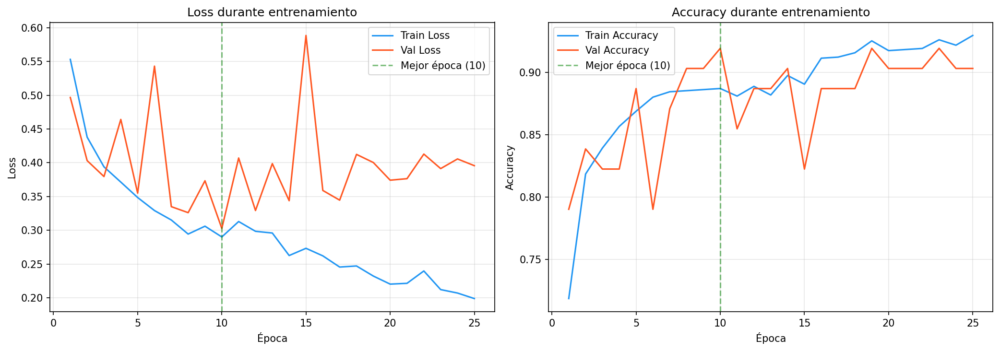
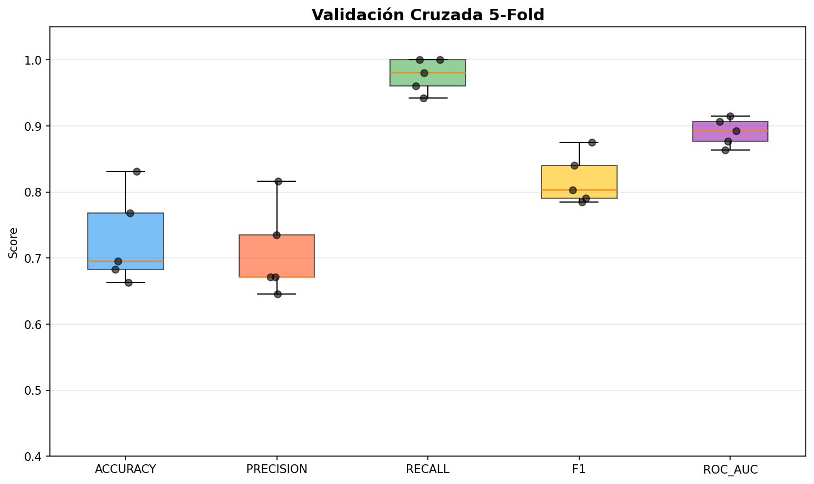

# Informe de Evaluacion: CNN para Deadlift Frontal

**Fecha de generacion:** 2026-07-22 00:48

---

## 1. Resumen del Dataset

| Metrica | Valor |
|---|---|
| Total de secuencias | 412 |
| Validos (label=1) | 256 (62.1%) |
| Invalidos (label=0) | 156 (37.9%) |
| Shape de datos | (412, 170, 25, 3) |

---

## 2. Arquitectura del Modelo

| Capa | Detalle |
|---|---|
| Conv2D + BatchNorm + ReLU | 32 filtros, kernel 3x3, padding same |
| Conv2D + BatchNorm + ReLU | 64 filtros, kernel 3x3, padding same |
| MaxPool2D | kernel (2, 1) |
| Dropout | 25% |
| Conv2D + BatchNorm + ReLU | 128 filtros, kernel 3x3, padding same |
| Global Average Pooling | Adaptativo (1x1) |
| Dense + ReLU + Dropout | 64 unidades, dropout 50% |
| Dense + Sigmoid | 1 unidad (salida binaria) |

### Hiperparametros

| Parametro | Valor |
|---|---|
| Learning Rate | 0.001 |
| Optimizer | Adam |
| Loss | Binary Cross-Entropy (BCE) |
| Batch Size | 16 |
| Early Stopping Patience | 15 epocas |
| ReduceLROnPlateau | factor 0.5, patience 5 |
| Data Augmentation | 3 aumentaciones por secuencia |
| Normalizacion temporal | 170 frames (percentil 90) |

---

## 3. Curvas de Entrenamiento

### Interpretacion Automatica

- **Mejor epoca:** 10
- **Mejor validation loss:** 0.3027
- **Diagnostico:** OVERFITTING

- El validation loss aumentó mientras el train loss seguía disminuyendo, indicando sobreajuste.
- El sobreajuste comenzó aproximadamente en la época 3.
- Se recomienda aumentar la regularización (dropout, weight decay) o reducir la capacidad del modelo.

---

## 4. Métricas en Test

| Métrica | Valor |
|---|---|
| Accuracy | 0.8871 |
| Precision | 0.9429 |
| Recall | 0.8684 |
| F1-Score | 0.9041 |
| ROC-AUC | 0.9254 |

### Matriz de Confusión

| | Pred: Inválido (0) | Pred: Válido (1) |
|---|---|---|
| **Real: Inválido (0)** | 22 (verdaderos negativos) | 2 (falsos positivos) |
| **Real: Válido (1)** | 5 (falsos negativos) | 33 (verdaderos positivos) |

---

## 5. Validación Cruzada (5-Fold)

<!-- Los resultados de 5-Fold CV se insertan aquí desde la ejecución de 06_cross_validation.py -->

> **Nota:** Los resultados de validación cruzada se generan ejecutando `06_cross_validation.py`. El análisis completo se encuentra en la salida de dicho script.

---

## 6. Análisis de Errores

### Falsos Positivos (FP) — 5 casos

Predichos como inválidos cuando eran válidos.

| # | video_id | Probabilidad |
|---|---|---|
| 1 | dl_267 | 0.1604 |
| 2 | dl_313 | 0.4574 |
| 3 | dl_427 | 0.2787 |
| 4 | dl_233 | 0.2116 |
| 5 | dl_354 | 0.0576 |

### Falsos Negativos (FN) — 2 casos

Predichos como válidos cuando eran inválidos.

| # | video_id | Probabilidad |
|---|---|---|
| 1 | dl_441 | 0.9970 |
| 2 | dl_253 | 0.6482 |

El listado completo con rutas de archivo se encuentra en `misclassified.csv`.

---

## 7. Conclusión General

### Estado Actual del Modelo

- El modelo CNN para clasificación binaria de deadlift frontal alcanzó un **F1-score de 0.9041** y un **ROC-AUC de 0.9254** en el conjunto de test.
- Se detectaron **7 errores** en el conjunto de test (5 FP, 2 FN).
- El análisis de curvas de entrenamiento indica **OVERFITTING**.

### Recomendaciones

- El modelo presenta un rendimiento sólido y puede considerarse para su uso en producción con supervisión.
- Se recomienda aumentar el dataset, especialmente la clase minoritaria (inválidos), para mejorar la robustez.
- Probar arquitecturas alternativas (LSTM, Transformer) podría ofrecer mejoras marginales.

---

*Informe generado automáticamente por el pipeline de evaluación.*
